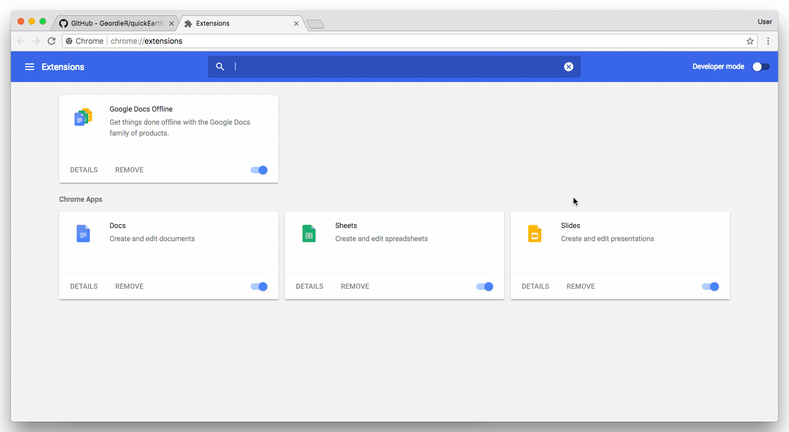
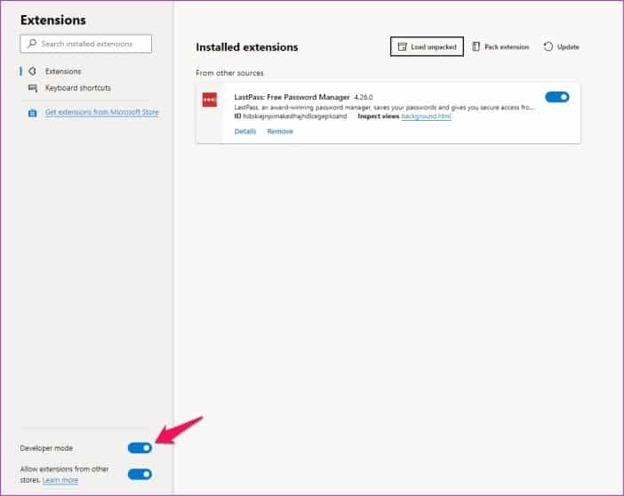

### Chrome
1. Unzip the downloaded file.
2. Activate the developer mode under your extensions settings to be able to load the extension.

### Edge
1. Unzip the downloaded file.
2. Activate the developer mode under your extensions settings to be able to load the extension.

> https://docs.microsoft.com/en-us/microsoft-edge/extensions-chromium/getting-started/extension-sideloading

### Firefox
1. Go to `about:config` (enter it into address bar).
2. Set `xpinstall.signatures.required` to `false`.
3. Go to `about:addons`.
4. Drag & drop the extension zip file or click on the  & choose install add-on from file.
